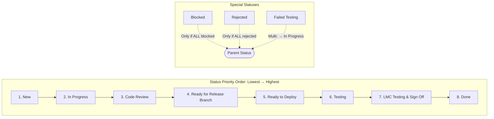

# Next.js Monorepo with Sanity CMS

A modern, full-stack monorepo template built with Next.js App Router, Sanity CMS, Shadcn UI, and TurboRepo.

```mermaid
flowchart TB
    subgraph Example1 [Example 1: Mixed Early Statuses]
        E1_SUB["Subtasks: [New, In Progress, Code Review]"]
        E1_LOGIC["Min = New, but work started"]
        E1_RESULT["Parent = In Progress ✓"]
        E1_SUB --> E1_LOGIC --> E1_RESULT
    end

    subgraph Example2 [Example 2: All Past In Progress]
        E2_SUB["Subtasks: [Code Review, Ready to Deploy, Done]"]
        E2_LOGIC["Min = Code Review"]
        E2_RESULT["Parent = Code Review ✓"]
        E2_SUB --> E2_LOGIC --> E2_RESULT
    end

    subgraph Example3 [Example 3: Single Subtask]
        E3_SUB["Subtask: [Failed Testing]"]
        E3_LOGIC["Single subtask = mirror"]
        E3_RESULT["Parent = Failed Testing ✓"]
        E3_SUB --> E3_LOGIC --> E3_RESULT
    end

    subgraph Example4 [Example 4: Failed Testing Multi]
        E4_SUB["Subtasks: [Failed Testing, Code Review]"]
        E4_LOGIC["Failed Testing + others"]
        E4_RESULT["Parent = In Progress ✓"]
        E4_SUB --> E4_LOGIC --> E4_RESULT
    end
```






## Features

### Monorepo Structure

- Apps: web (Next.js frontend) and studio (Sanity Studio)
- Shared packages: UI components, TypeScript config, ESLint config
- Turborepo for build orchestration and caching

### Frontend (Web)

- Next.js App Router with TypeScript
- Shadcn UI components with Tailwind CSS
- Server Components and Server Actions
- SEO optimization with metadata
- Blog system with rich text editor
- Table of contents generation
- Responsive layouts

### Content Management (Studio)

- Sanity Studio v3
- Custom document types (Blog, FAQ, Pages)
- Visual editing integration
- Structured content with schemas
- Live preview capabilities
- Asset management

## Getting Started

### Installing the template

#### 1. Run Studio and Next.js app locally

Navigate to the template directory using `cd <your app name>`, and start the development servers by running the following command

```shell
pnpm run dev
```

#### 2. Open the app and sign in to the Studio

Open the Next.js app running locally in your browser on [http://localhost:3000](http://localhost:3000).

Open the Studio running locally in your browser on [http://localhost:3333](http://localhost:3333). You should now see a screen prompting you to log in to the Studio. Use the same service (Google, GitHub, or email) that you used when you logged in to the CLI.

### Adding content with Sanity

#### 1. Publish your first document

The template comes pre-defined with a schema containing `Author`, `Blog`, `BlogIndex`, `FAQ`, `Footer`, `HomePage`, `Navbar`, `Page`, and `Settings` document types.

From the Studio, click "+ Create" and select the `Blog` document type. Go ahead and create and publish the document.

Your content should now appear in your Next.js app ([http://localhost:3000](http://localhost:3000)) as well as in the Studio on the "Presentation" Tab

#### 2. Sample Content

When you initialize the template using the Sanity CLI, sample content is not automatically imported into your project. However, you can import it after the init is done. This data includes example blog posts, authors, and other content types to help you get started quickly (see next step).

#### 3. Seed data using script

To add sample data programmatically, run the following command:

```shell
cd apps/studio
npx sanity exec scripts/create-data.ts --with-user-token
```

This command executes a TypeScript script that creates and populates content in your Sanity dataset.

#### 4. Extending the Sanity schema

The schemas for all document types are defined in the `studio/schemaTypes/documents` directory. You can [add more document types](https://www.sanity.io/docs/schema-types) to the schema to suit your needs.

On adding schemas, be sure to update your sanity types by running:

```bash
npx sanity schema extract --enforce-required-fields
npx sanity typegen generate
```

### Deploying your application and inviting editors

#### 1. Deploy Sanity Studio

Your Next.js frontend (`/web`) and Sanity Studio (`/studio`) are still only running on your local computer. It's time to deploy and get it into the hands of other content editors.

> **Note**: To use the GitHub Actions workflow, make sure to configure the following secrets in your repository settings:
>
> - `SANITY_DEPLOY_TOKEN`
> - `SANITY_STUDIO_PROJECT_ID`
> - `SANITY_STUDIO_DATASET`
> - `SANITY_STUDIO_TITLE`
> - `SANITY_STUDIO_PRESENTATION_URL`
> - `SANITY_STUDIO_PRODUCTION_HOSTNAME`

Set `SANITY_STUDIO_PRODUCTION_HOSTNAME` to whatever you want your deployed Sanity Studio hostname to be. Eg. for `SANITY_STUDIO_PRODUCTION_HOSTNAME=my-cool-project` you'll get a studio URL of `https://my-cool-project.sanity.studio` (and `<my-branch-name>-my-cool-project.sanity.studio` for PR previews builds done automatically via the `deploy-sanity.yml` github CI workflow when you open a PR.)

Set `SANITY_STUDIO_PRESENTATION_URL` to your web app front-end URL (from the Vercel deployment). This URL is required for production deployments and should be:

- Set in your GitHub repository secrets for CI/CD deployments
- Set in your local environment if deploying manually with `npx sanity deploy`
- Not needed for local development, where preview will automatically use http://localhost:3000

You can then manually deploy from your Studio directory (`/studio`) using:

```shell
npx sanity deploy
```

**Note**: To use the live preview feature, your browser needs to enable third party cookies.

#### 2. Deploy Next.js app to Vercel

You have the freedom to deploy your Next.js app to your hosting provider of choice. With Vercel and GitHub being a popular choice, we'll cover the basics of that approach.

1. Create a GitHub repository from this project. [Learn more](https://docs.github.com/en/migrations/importing-source-code/using-the-command-line-to-import-source-code/adding-locally-hosted-code-to-github).
2. Create a new Vercel project and connect it to your Github repository.
3. Set the `Root Directory` to your Next.js app (`/apps/web`).
4. Configure your Environment Variables.

#### 3. Invite a collaborator

Now that you've deployed your Next.js application and Sanity Studio, you can optionally invite a collaborator to your Studio. Open up [Manage](https://www.sanity.io/manage), select your project and click "Invite project members"

They will be able to access the deployed Studio, where you can collaborate together on creating content.

# Shout out

Huge thanks to [RoboTo Studio](https://robotostudio.com) for creating this template and making it available to the community. If you find this template useful, consider supporting their work.

# Icons

https://lucide.dev/icons/
